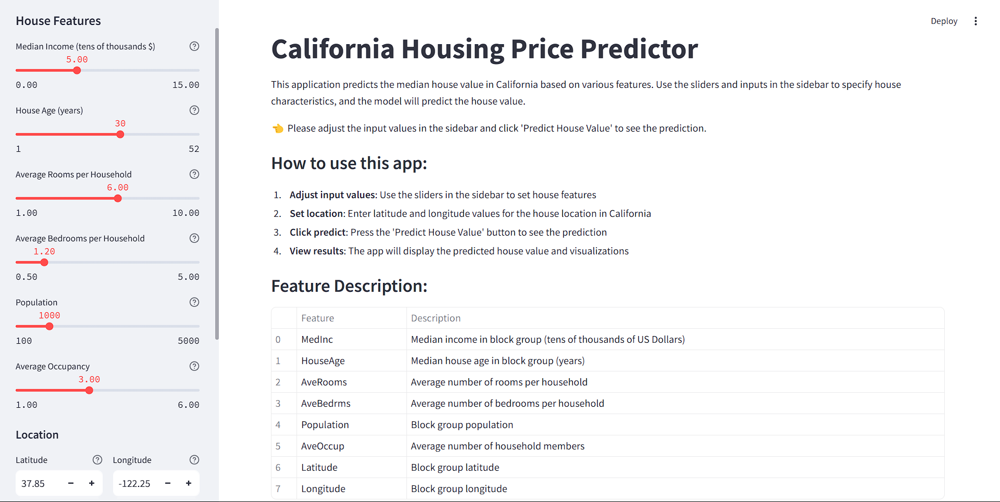
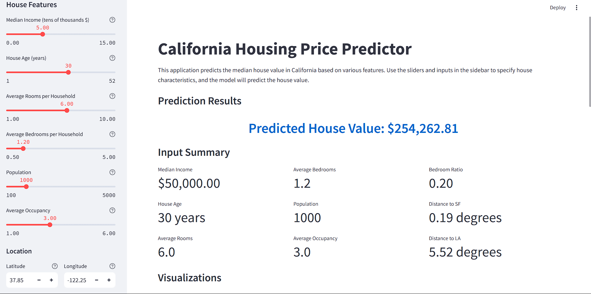
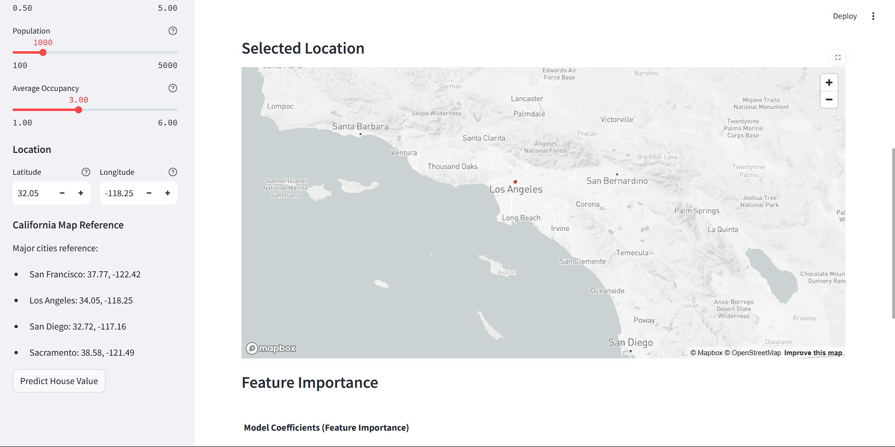

# California Housing Price Prediction


A machine learning project that predicts housing prices in California using regression techniques. This project includes comprehensive exploratory data analysis, feature engineering, linear regression modeling, and an interactive Streamlit web application for making predictions.

# screenshots

## landing page


## prediction page


## map



## 📊 Dataset

The project uses the California Housing dataset, which contains information about housing in California based on the 1990 census data. Each record represents a block group (a neighborhood-like area with a population of 600-3,000 people).

Features include:
- Median income
- House age
- Average number of rooms
- Average number of bedrooms
- Population
- Average occupancy
- Latitude
- Longitude
- Median house value (target variable)

## 🚀 Project Structure

```
├── california_housing.csv       # Dataset
├── EDA.ipynb   # Exploratory Data Analysis script
├── california_housing_regression.py # Model training script
├── streamlit_app.py             # Interactive web application
├── models/                      # Directory containing saved models
│   ├── linear_regression_model.pkl 
│   ├── scaler.pkl
│   └── feature_names.pkl
└── README.md                    # Project documentation
```

## 📋 Features

- **Comprehensive Exploratory Data Analysis**
  - Statistical analysis of features
  - Correlation analysis
  - Geographic visualization
  - Feature distribution analysis
  - Outlier detection

- **Feature Engineering**
  - Created new features like BedroomRatio, RoomsPerHousehold
  - Location-based features (distance to major cities, coastal proximity)
  - Improved model performance with engineered features

- **Linear Regression Model**
  - Achieved approximately 65% prediction accuracy (R² score)
  - Feature importance analysis
  - Model evaluation with multiple metrics (RMSE, MAE, R²)

- **Interactive Prediction Application**
  - Streamlit web interface for making predictions
  - Adjustable inputs using sliders
  - Visualizations of predictions and feature importance

## 🛠️ Installation

1. Clone this repository
```bash
git clone https://github.com/yourusername/regression-streamlit.git
cd regression-streamlit
```

2. Create a virtual environment and activate it (optional but recommended)
```bash
python -m venv env
source env/bin/activate  # On Windows, use: env\Scripts\activate
```

3. Install dependencies
```bash
pip install -r requirements.txt
```

## 💻 Usage


### 1. Train the Model
```bash
python california_housing_regression.py
```
This will train the linear regression model and save it to the `models` directory.

### 2. Launch the Streamlit Application
```bash
streamlit run streamlit_app.py
```
This will open a web browser with the interactive prediction interface.

## 📈 Model Performance

The linear regression model achieved the following performance metrics:

- **Training RMSE**: 0.67
- **Test RMSE**: 0.67
- **Training R²**: 0.67
- **Test R²**: 0.66
- **Model Accuracy**: 65.73%

Feature importance analysis showed that the following features have the strongest influence on housing prices:
1. Median Income
2. Geographic Location (Latitude/Longitude)
3. Population Density
4. Bedroom Ratio


## 👨‍💻 Author

[Bhuvan S Prasad](https://github.com/Bhuvan-S-prasad)

## ackwnowledgements

This project was completed under the invaluable guidance of [Dr. Agughasi Victor Ikechukwu](https://github.com/Victor-Ikechukwu) . I sincerely appreciate his mentorship, support, and expertise throughout the process. His insights and encouragement have been instrumental in shaping this work.
